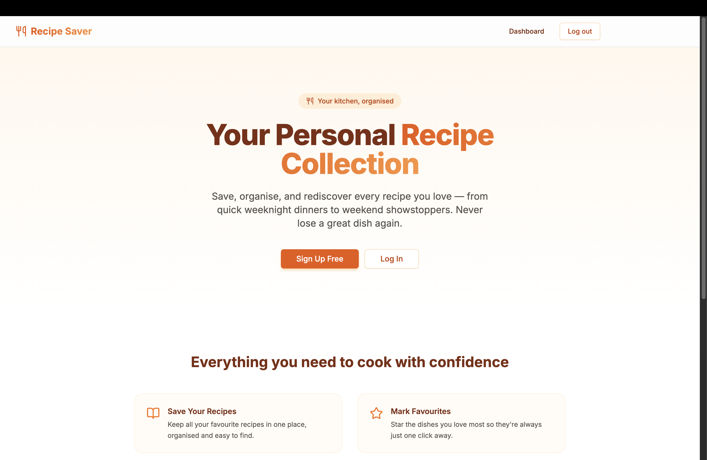
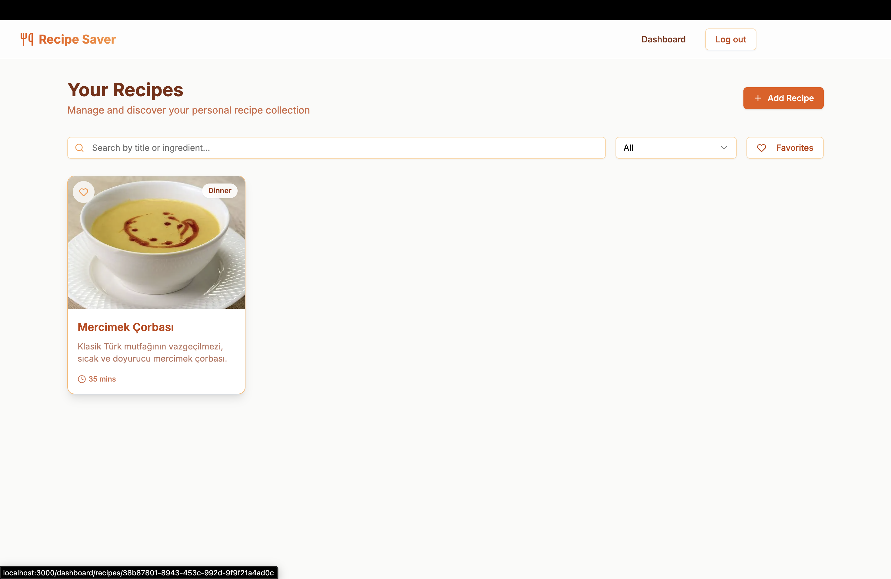
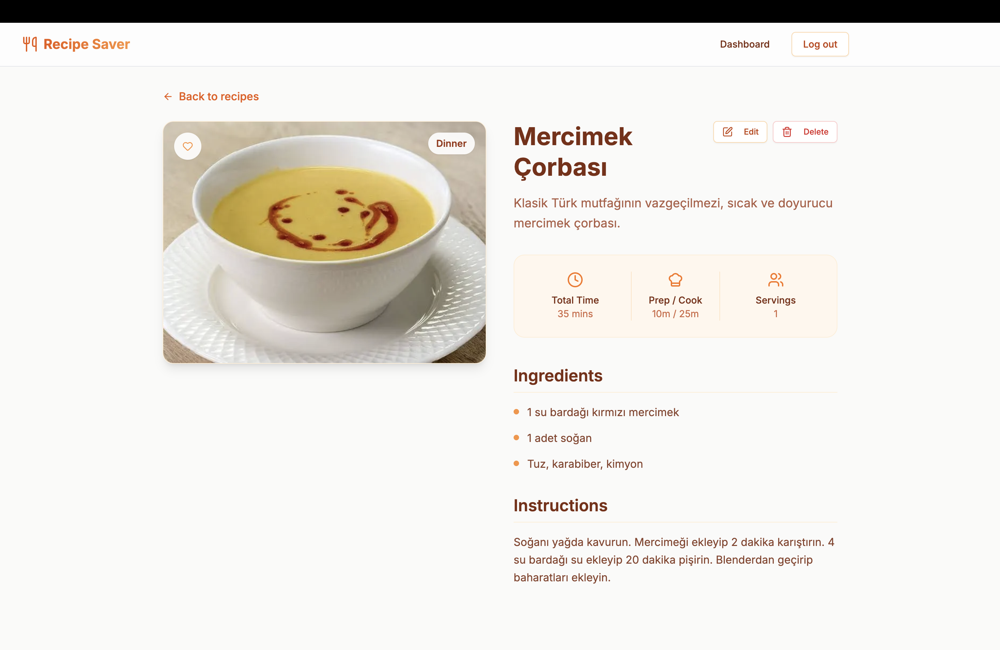

# 🍳 Recipe Saver


A personal recipe collection app — save, organise, and rediscover every dish you love. Built with the **Next.js 14 App Router**, **Supabase** (Auth, PostgreSQL, Storage), and a warm orange UI powered by Tailwind CSS and shadcn/ui.


---

## 📸 Screenshots

| Landing Page | Dashboard | Recipe Detail |
|---|---|---|
|  |  |  |

---

## ✨ Features

- 🔐 **Email / password authentication** — sign up and log in on the same page, powered by Supabase Auth
- 🛡️ **Route protection** — Next.js middleware redirects unauthenticated users away from `/dashboard`; logged-in users are redirected away from `/login`
- 📋 **Full recipe CRUD** — create, view, edit, and delete recipes with a polished multi-section form
- 🖼️ **Photo upload** — drag-and-drop style photo picker uploads images to Supabase Storage; photos are cleaned up automatically on recipe deletion
- ⭐ **Favourites** — one-click favourite toggle on both the card grid and the detail page
- 🔍 **Real-time search** — debounced (300 ms) full-text search across title and description via URL query params
- 🗂️ **Category filter** — filter recipes by Breakfast, Lunch, Dinner, Dessert, or Snacks
- ❤️ **Favourites filter** — show only starred recipes with a single click
- 📱 **Fully responsive** — mobile-first grid layout (1 → 2 → 3 → 4 columns)
- 🔒 **Row-Level Security** — every Supabase query is scoped to the authenticated user; data isolation is enforced at the database level

---

## 🛠️ Tech Stack

| Layer | Technology | Version |
|---|---|---|
| Framework | [Next.js](https://nextjs.org) (App Router) | 14.2.x |
| Language | TypeScript | 5.x |
| Database / Auth / Storage | [Supabase](https://supabase.com) | 2.x |
| Supabase JS client | `@supabase/supabase-js` | 2.98.x |
| Supabase SSR helpers | `@supabase/ssr` | 0.8.x |
| Styling | Tailwind CSS | 3.4.x |
| Component library | [shadcn/ui](https://ui.shadcn.com) (Radix UI) | latest |
| Form handling | react-hook-form | 7.x |
| Schema validation | Zod | 4.x |
| Notifications | sonner | 2.x |
| Icons | lucide-react | 0.575.x |

---

## 🚀 Getting Started

### Prerequisites

- **Node.js** 18.17 or later
- **npm** (or pnpm / yarn / bun)
- A free [Supabase](https://supabase.com) account

### Installation

```bash
# 1. Clone the repository
git clone https://github.com/your-username/supabase-recipe-app.git
cd supabase-recipe-app

# 2. Install dependencies
npm install

# 3. Copy the environment variable template
cp .env.local.example .env.local
# then fill in your Supabase credentials (see below)

# 4. Start the development server
npm run dev
```

Open [http://localhost:3000](http://localhost:3000) in your browser.

---

## 🗄️ Supabase Setup

### 1. Create a project

Go to [supabase.com/dashboard](https://supabase.com/dashboard), create a new project, and note your **Project URL** and **anon public key** from **Project Settings → API**.

### 2. Run the database schema

Open the **SQL Editor** in your Supabase dashboard and run:

```sql
-- Create the recipes table
CREATE TABLE public.recipes (
    id           UUID        DEFAULT gen_random_uuid() PRIMARY KEY,
    user_id      UUID        NOT NULL REFERENCES auth.users(id) ON DELETE CASCADE,
    title        TEXT        NOT NULL,
    description  TEXT,
    category     TEXT        NOT NULL CHECK (category IN ('Breakfast', 'Lunch', 'Dinner', 'Dessert', 'Snacks')),
    ingredients  TEXT[]      DEFAULT '{}',
    instructions TEXT        NOT NULL,
    prep_time    INTEGER     CHECK (prep_time >= 0),
    cook_time    INTEGER     CHECK (cook_time >= 0),
    servings     INTEGER     CHECK (servings >= 1),
    photo_url    TEXT,
    is_favorite  BOOLEAN     NOT NULL DEFAULT FALSE,
    created_at   TIMESTAMPTZ DEFAULT NOW(),
    updated_at   TIMESTAMPTZ DEFAULT NOW()
);

-- Helpful index for per-user queries
CREATE INDEX recipes_user_id_idx ON public.recipes (user_id);
```

### 3. Enable Row-Level Security

```sql
-- Enable RLS on the table
ALTER TABLE public.recipes ENABLE ROW LEVEL SECURITY;

-- Users can only read their own recipes
CREATE POLICY "Users can view own recipes"
    ON public.recipes FOR SELECT
    USING (auth.uid() = user_id);

-- Users can only insert recipes for themselves
CREATE POLICY "Users can insert own recipes"
    ON public.recipes FOR INSERT
    WITH CHECK (auth.uid() = user_id);

-- Users can only update their own recipes
CREATE POLICY "Users can update own recipes"
    ON public.recipes FOR UPDATE
    USING (auth.uid() = user_id)
    WITH CHECK (auth.uid() = user_id);

-- Users can only delete their own recipes
CREATE POLICY "Users can delete own recipes"
    ON public.recipes FOR DELETE
    USING (auth.uid() = user_id);
```

### 4. Create the Storage bucket

In **Storage → New bucket**, create a bucket with these settings:

| Setting | Value |
|---|---|
| Name | `recipe-photos` |
| Public bucket | ✅ Yes |
| File size limit | `5242880` (5 MB) |
| Allowed MIME types | `image/jpeg, image/png, image/webp, image/gif` |

Then add Storage RLS policies so users can manage only their own files:

```sql
-- Allow authenticated users to upload into their own folder
CREATE POLICY "Users can upload own photos"
    ON storage.objects FOR INSERT
    TO authenticated
    WITH CHECK (
        bucket_id = 'recipe-photos'
        AND (storage.foldername(name))[1] = auth.uid()::text
    );

-- Allow public read access so photo URLs work without a signed URL
CREATE POLICY "Public read access for recipe photos"
    ON storage.objects FOR SELECT
    TO public
    USING (bucket_id = 'recipe-photos');

-- Allow users to delete their own photos
CREATE POLICY "Users can delete own photos"
    ON storage.objects FOR DELETE
    TO authenticated
    USING (
        bucket_id = 'recipe-photos'
        AND (storage.foldername(name))[1] = auth.uid()::text
    );
```

---

## 🔑 Environment Variables

Create a `.env.local` file in the project root (never commit this file):

```env
NEXT_PUBLIC_SUPABASE_URL=https://your-project-id.supabase.co
NEXT_PUBLIC_SUPABASE_ANON_KEY=your-anon-public-key
```

| Variable | Description | Where to find it |
|---|---|---|
| `NEXT_PUBLIC_SUPABASE_URL` | Your Supabase project's API URL | Project Settings → API → Project URL |
| `NEXT_PUBLIC_SUPABASE_ANON_KEY` | Public anon key (safe to expose in the browser) | Project Settings → API → Project API keys |

> ⚠️ The `NEXT_PUBLIC_` prefix intentionally exposes these values to the browser. The anon key is safe to expose because Row-Level Security enforces data isolation at the database level.

---

## 📁 Project Structure

```
supabase-recipe-app/
├── src/
│   ├── app/
│   │   ├── layout.tsx                  # Root layout — Navbar + Toaster
│   │   ├── page.tsx                    # Public landing page
│   │   ├── globals.css
│   │   ├── login/
│   │   │   ├── page.tsx               # Combined login + sign-up form
│   │   │   └── actions.ts             # Server actions: login, signup, signout
│   │   └── dashboard/
│   │       ├── page.tsx               # Recipe grid with search & filters
│   │       ├── loading.tsx            # Skeleton loading state
│   │       └── recipes/
│   │           ├── actions.ts         # Server actions: deleteRecipe, toggleFavorite
│   │           ├── new/
│   │           │   └── page.tsx       # Create recipe page
│   │           └── [id]/
│   │               ├── page.tsx       # Recipe detail view
│   │               └── edit/
│   │                   └── page.tsx   # Edit recipe page
│   ├── components/
│   │   ├── layout/
│   │   │   └── Navbar.tsx             # Sticky nav with auth-aware links
│   │   ├── recipes/
│   │   │   ├── RecipeCard.tsx         # Card with photo, timing, favourite button
│   │   │   ├── RecipeFilterBar.tsx    # Search input, category select, favourites toggle
│   │   │   ├── RecipeForm.tsx         # Shared create/edit form (react-hook-form + Zod)
│   │   │   ├── FavoriteButton.tsx     # Heart toggle (client component, server action)
│   │   │   └── DeleteRecipeButton.tsx # Confirm-before-delete alert dialog
│   │   ├── shared/
│   │   │   └── ImageUpload.tsx        # Photo picker with live preview + Supabase upload
│   │   └── ui/                        # shadcn/ui primitives (Button, Card, Dialog…)
│   ├── hooks/
│   │   ├── use-toast.ts               # Toast hook (shadcn/ui)
│   │   └── use-debounce.ts            # Generic debounce hook
│   ├── lib/
│   │   ├── utils.ts                   # cn() helper (clsx + tailwind-merge)
│   │   └── supabase/
│   │       ├── client.ts              # Browser Supabase client
│   │       └── server.ts              # Server-side Supabase client (cookie-based)
│   ├── middleware.ts                  # Auth guard + post-login redirect
│   └── types/
│       └── database.types.ts          # Supabase database type definitions
├── public/
├── .env.local                         # ← create this file (see above)
├── next.config.mjs
├── tailwind.config.ts
├── components.json                    # shadcn/ui configuration
├── tsconfig.json
└── package.json
```

---

## 📜 Available Scripts

| Command | Description |
|---|---|
| `npm run dev` | Start the development server at `http://localhost:3000` |
| `npm run build` | Build for production |
| `npm run start` | Start the production server |
| `npm run lint` | Run ESLint |

---

## 🤝 Contributing

Contributions are welcome! Here's how to get started:

1. **Fork** the repository and clone your fork
2. Create a feature branch: `git checkout -b feat/your-feature-name`
3. Make your changes, following the existing code style
4. Commit with a descriptive message: `git commit -m "feat: add your feature"`
5. Push to your fork: `git push origin feat/your-feature-name`
6. Open a **Pull Request** against `main`

Please ensure your PR:
- Passes `npm run lint` with no new errors
- Passes `npm run build` cleanly
- Includes a short description of what was changed and why

---

## 📄 License

This project is licensed under the **MIT License** — you are free to use, modify, and distribute it for any purpose.

```
MIT License

Copyright (c) 2024 Recipe Saver Contributors

Permission is hereby granted, free of charge, to any person obtaining a copy
of this software and associated documentation files (the "Software"), to deal
in the Software without restriction, including without limitation the rights
to use, copy, modify, merge, publish, distribute, sublicense, and/or sell
copies of the Software, and to permit persons to whom the Software is
furnished to do so, subject to the following conditions:

The above copyright notice and this permission notice shall be included in all
copies or substantial portions of the Software.

THE SOFTWARE IS PROVIDED "AS IS", WITHOUT WARRANTY OF ANY KIND, EXPRESS OR
IMPLIED, INCLUDING BUT NOT LIMITED TO THE WARRANTIES OF MERCHANTABILITY,
FITNESS FOR A PARTICULAR PURPOSE AND NONINFRINGEMENT. IN NO EVENT SHALL THE
AUTHORS OR COPYRIGHT HOLDERS BE LIABLE FOR ANY CLAIM, DAMAGES OR OTHER
LIABILITY, WHETHER IN AN ACTION OF CONTRACT, TORT OR OTHERWISE, ARISING FROM,
OUT OF OR IN CONNECTION WITH THE SOFTWARE OR THE USE OR OTHER DEALINGS IN THE
SOFTWARE.
```
